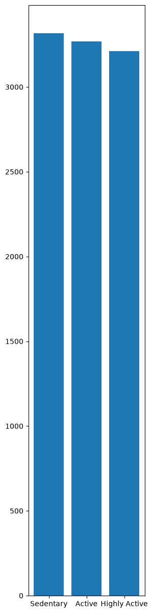

Overview:

The goal of this project was to test my skills using different tools, such as VS Code for Python and PostgreSQL for SQL to examine, clean up, and analyze data gathered from users' smartwatches. This is my first project after learning how to work with data for about a month. It was pretty hard at first, but I had fun scrounging through my notes in a way! 

Background: 
a
I am someone that others would consider fit, or at least strong anyway. I figured that the best data I could start out with would be something fitness-related. Ding! That's when the search began! I found some anonymous smartwatch data from Kaggle that I could work with, as it wasn't too complicated for a first project.

Tools Used:

Python
-Pandas
-NumPy
-Matplotlib
PostgreSQL

Cleaning the Data:

I used a dataset with 10,000 rows. They were organized into 7 columns. A couple of things needed cleaning up before I could analyze the data. 

- Multiple missing values across  every row and column
- Some very unlikely data values (ex. heart rates way above 250 BPM 
- Error values listed in some of the rows in the 'Sleep Level' column
- Inconsistencies in the input of certain data values (Highly Active vs Highly_Active in the "Activity Level" column)
- Typographical errors (Sedentary vs. Seddentary in the "Activity Level" column)

Database Design:

I decided to split the dataset into 2 tables: an activity table and a biometric data table. 

Biometric Data

| Column | Description |
| user_id | Unique user identifier |
| heart_rate | Recorded heart rate |
| blood_oxygen_level | Recorded blood oxygen level |

Activity Data

| Column | Description |
| user_id | Unique user identifier |
| step_count | Number of steps recorded |
| sleep_count_hrs | Recorded sleep duration |
| activity_level | User's activity classification |
| stress_level | Recorded stress level |

SQL Queries:

I used a couple of SQL queries to answer some basic questions.

1. What is the average heart rate of users in each activity level?
Query Used:  SELECT activity_level, ROUND(AVG(heart_rate))
             FROM public.health_data1
             GROUP BY activity_level;
Answer: Surprisingly enough, the average heart rate in every category was 76 BPM.

3. What is the average step count for users in each activity level?
Query Used: SELECT activity_level, ROUND(AVG(step_count)) 
            FROM public.health_data1
            GROUP BY activity_level;

Answer: Average step count for active users = 7064.
        Average step count for highly active users = 6961
        Average step count for sedentary users = 6972
  Surprisingly, there isn't much difference between categories. 

3. What is the average step count and stress level of users deemed highly active?
Query Used: SELECT activity_level, ROUND(AVG(step_count)), ROUND(AVG(stress_level))
            FROM public.health_data1
            WHERE activity_level = 'Highly Active'
            GROUP BY activity_level;
Answer: The highly active category of users had an average step count of 6,961 and an average stress level of 5.

5. Which user had the highest step count?
Query Used: SELECT user_id, step_count
            FROM public.health_data1
            ORDER BY step_count DESC
            LIMIT 5;
Answer: Users with user_id = 16376 and user_id = 4750 tied for the highest step count with a count of 62487. Couldn't imagine walking that much in a single day.

Visualizations: 

I used matplotlib (which I learned recently) to make 2 charts so I could get some practice with it. I've attached them in my files. 

Counts for Each Activity Level
 

![Scatter Chart(heart rate vs. step count](

What I've Learned:

After going through the motions, stressing what code does what, etc., I've solidified my knowledge when it comes to working with different libraries within Python, using VSCode as an IDE, and using PostgreSQL to run queries to get answers to analytical questions based on this dataset. 
